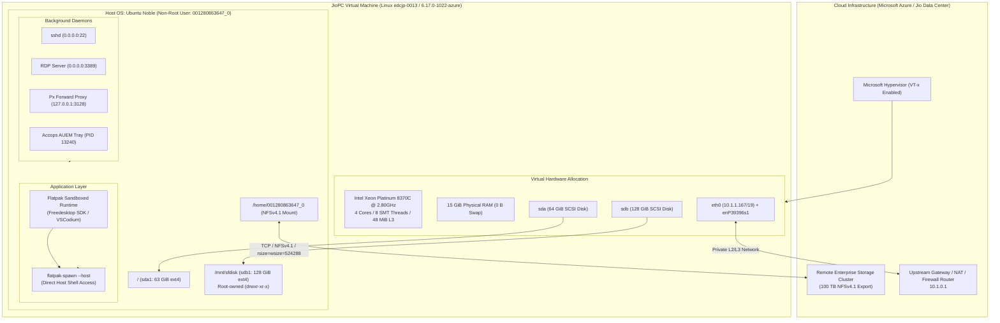
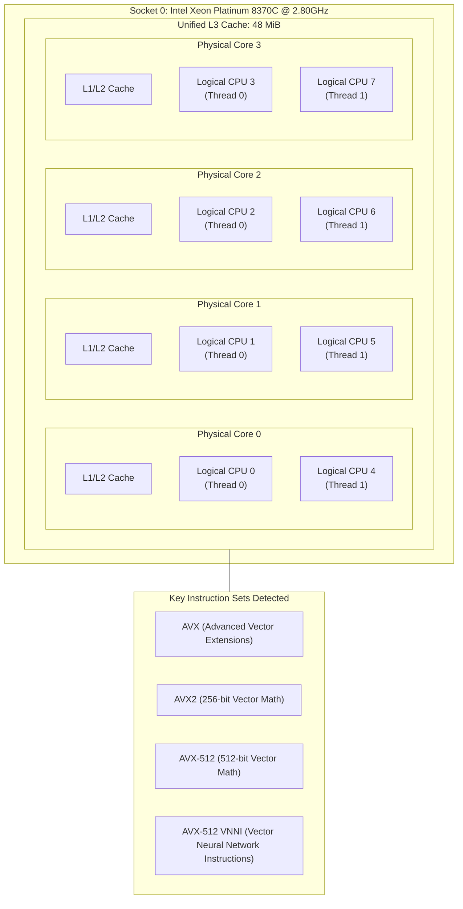
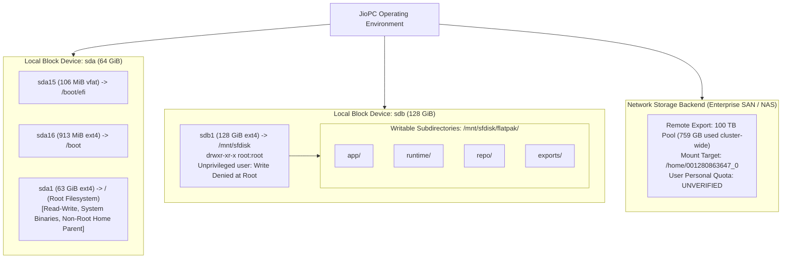
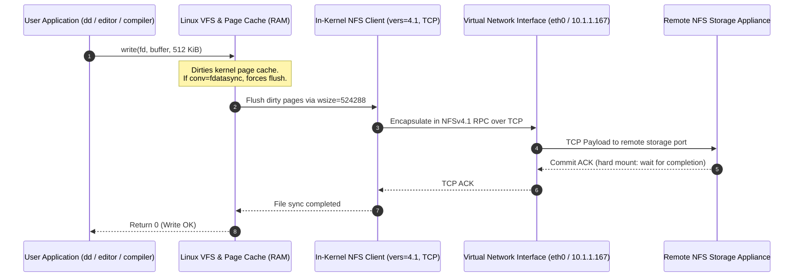
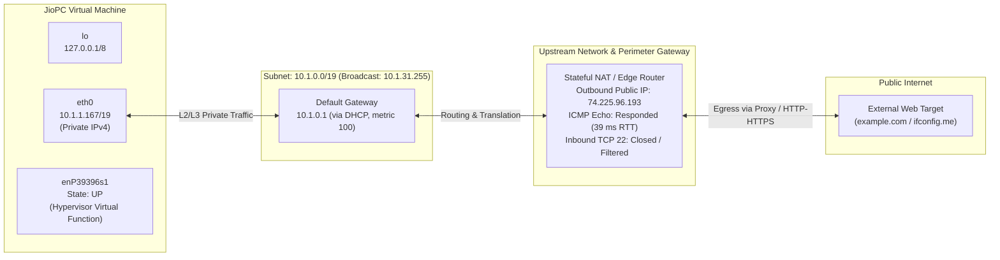
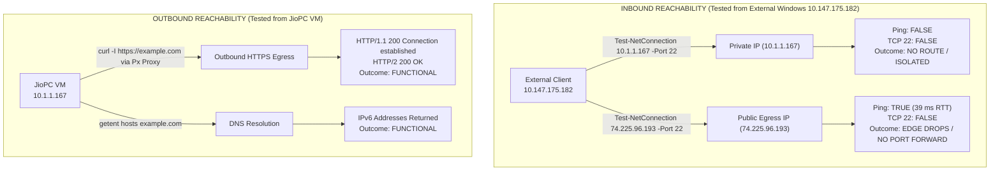

# Day 1: Architecture & Topology Diagrams

This document collects architectural schematics, network topologies, and benchmark visualizations produced during Day 1 (*Infrastructure Reconnaissance*) of the 7-day JioPC empirical evaluation.

---

## 1. Overall JioPC Architecture

High-level decomposition of the virtualized environment, showing the hypervisor layer, guest operating system, containerized user session, local block devices, and remote storage mounts.



---

## 2. CPU Topology

Empirical topology of the compute subsystem determined from `lscpu`. The 8 logical processors reported to the OS stem from 4 physical execution cores leveraging 2-way Simultaneous Multithreading (SMT).



---

## 3. Storage Architecture

Hierarchical disk layout distinguishing local block devices from remote networked file storage.



---

## 4. NFS Architecture & Protocol Pipeline

Data flow between user-space application processes and the remote enterprise storage backend via NFSv4.1.



---

## 5. Network Topology & Interface Map

Logical network configuration showing VM interface assignments, private subnet addressing, default gateway, and public NAT egress point.



---

## 6. Outbound Proxy Traffic Path

Path of outbound HTTP and HTTPS requests from user processes through the locally running `Px` forward proxy instance.

```mermaid
graph TD
    subgraph ClientLayer["Client Layer (JioPC Shell)"]
        CLI["CLI Tool / App (curl, apt, git, python)"]
        ENV["Environment Variables:<br/>HTTP_PROXY=http://127.0.0.1:3128<br/>HTTPS_PROXY=http://127.0.0.1:3128<br/>NO_PROXY=localhost,127.0.0.1,::1"]
    end

    subgraph LocalProxyLayer["Local Proxy Mediation Layer"]
        PX["Local Proxy Daemon (Px)<br/>127.0.0.1:3128<br/>(Proxy-Agent: Px)"]
    end

    subgraph UpstreamTransit["Enterprise Upstream Transit"]
        PROXY_FWD["Corporate / Cloud Upstream Proxy or NAT Gateway"]
    end

    subgraph RemoteServer["Public Internet"]
        DEST["Remote Host (e.g. https://example.com)"]
    end

    CLI -->|Read proxy config| ENV
    ENV -->|CONNECT or GET to 127.0.0.1:3128| PX
    PX -->|HTTP/1.1 200 Connection established| PROXY_FWD
    PROXY_FWD -->|Negotiate TLS / HTTP/2| DEST
    DEST -->>|Response stream| PROXY_FWD
    PROXY_FWD -->>|Relay| PX
    PX -->>|Forwarded response| CLI
```

---

## 7. Inbound vs. Outbound Connectivity Boundary

Matrix visualizing boundary enforcement: external traffic egress vs. ingress reachability on private and public IP endpoints.



---

## 8. Day 1 Experimental Workflow

Chronological flow of reconnaissance procedures executed during Day 1.

```mermaid
flowchart TD
    START([Day 1 Reconnaissance Initiated]) --> STEP1[1. Execution Context & Privileges<br/>- Discover Flatpak container runtime<br/>- Break out via flatpak-spawn --host<br/>- Audit user: 001280863647_0, non-root]
    STEP1 --> STEP2[2. Compute & Topology Audit<br/>- Execute lscpu<br/>- Identify Intel Xeon 8370C<br/>- Map 4 cores / 8 threads / AVX-512]
    STEP2 --> STEP3[3. Memory & Swap Inspection<br/>- Execute free -h<br/>- Measured 15 GiB RAM, 12 GiB avail<br/>- Flag 0 B swap as OOM risk]
    STEP3 --> STEP4[4. Storage Hierarchy Mapping<br/>- Audit lsblk & df -hT<br/>- Classify sda root vs sdb sfdisk<br/>- Discover NFS-backed /home directory]
    STEP4 --> STEP5[5. Storage Benchmarking<br/>- Test /mnt/sfdisk write: Permission Denied<br/>- NFS sequential write: 342 - 663 MB/s<br/>- NFS read: 8.4 GB/s cached vs 73.1 MB/s fresh]
    STEP5 --> STEP6[6. Network & Interface Discovery<br/>- Audit ip addr & ip route<br/>- Private IP: 10.1.1.167/19<br/>- Default Gateway: 10.1.0.1]
    STEP6 --> STEP7[7. Egress & Proxy Analysis<br/>- Discover HTTP_PROXY 127.0.0.1:3128<br/>- Verify HTTPS outbound with curl<br/>- Determine public egress IP: 74.225.96.193]
    STEP7 --> STEP8[8. Listening Ports & Inbound Boundary<br/>- Audit ss -tuln (SSH, RDP, Px, Accops)<br/>- Local SSH reaches daemon, auth rejected<br/>- External Windows probe fails on TCP 22]
    STEP8 --> FINISH([Formulate Day 1 Working Hypothesis])
```

---

## 9. Benchmark Visualizations

### Chart 1: NFS Write Throughput Comparison (MB/s)

Measurements taken with 2 GiB data payloads using `conv=fdatasync` to enforce physical storage synchronization.

```
NFS Sequential Write (Run 1)     [402 MB/s] | ████████████████████ (402)
NFS Sequential Write (Run 2)     [663 MB/s] | █████████████████████████████████ (663)
NFS Random Data Write (/dev/urandom) [342 MB/s] | █████████████████ (342)
                                            +---------+---------+---------+---------+
                                            0        200       400       600     800 MB/s
```

*Note: High variance (342 MB/s to 663 MB/s) illustrates dynamic backend shared storage behavior and burst buffering. No single throughput number characterizes the NFS tier.*

---

### Chart 2: NFS Read Throughput: Cached vs. Fresh File

Comparison highlighting the critical impact of Linux kernel page caching.

```
Fresh Uncached File Read           [73.1 MB/s]   | █ (73.1)
Cached / Immediate Reread [!]    [8400.0 MB/s]   | ████████████████████████████████████████ (8400)
                                                 +---------------------------------------+
                                                 0                                  9000 MB/s

[!] WARNING: The 8,400 MB/s figure reflects reading directly from system RAM (Linux Page Cache).
    It MUST NOT be interpreted as physical or networked NFS throughput.
    Real uncached read throughput over the network interface was measured at 73.1 MB/s.
```

---

### Chart 3: Storage Capacity & Utilization Overview

Comparison across storage tiers based on `df -hT` output.

| Storage Tier | Mount Point | Filesystem | Reported Size | Used Space | Available Space | Utilization % | Role / Accessibility |
| :--- | :--- | :--- | :--- | :--- | :--- | :--- | :--- |
| **Local OS Root** | `/` | ext4 (`sda1`) | 61 GB | 13 GB | 49 GB | 21% | Read-Write, System OS files, Non-root user writable in `/tmp` |
| **Local Secondary** | `/mnt/sfdisk` | ext4 (`sdb1`) | 126 GB | 71 GB | 49 GB | 59% | Root-owned; Flatpak runtime store; User write denied at root |
| **Remote Home** | `/home/001280863647_0` | nfs4 (`vers=4.1`) | 100 TB* | ~759 GB | ~99.2 TB | < 1% | Shared cluster pool export. **User quota is UNVERIFIED.** |

*\*CRITICAL CLARIFICATION: The 100 TB reported figure represents the aggregate capacity of the backend NFS export pool across the infrastructure. It does NOT denote an individual allocation or guaranteed quota for the user account.*
